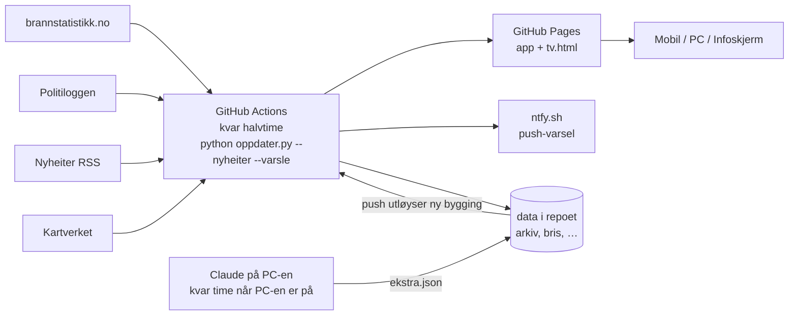

# Brannlogg Stord

Ei nettside/app som viser brannar og andre oppdrag for brannvesenet i Stord kommune. Ho hentar data frå brannstatistikken, Politiloggen og lokale nyheiter, oppdaterer seg sjølv kvar halvtime og kan leggjast på heimeskjermen på iPhone, Android og Windows.

Laga av **Leander Wågen Lillerud**. Ikkje ein offisiell teneste frå Politiet, brannvesenet eller Stord kommune.

| | Adresse |
|---|---|
| App (mobil og PC) | https://lillerud-land1.github.io/brannlogg/ |
| Infoskjerm / TV | https://lillerud-land1.github.io/brannlogg/tv.html |
| Kjeldekode og køyringar | https://github.com/Lillerud-land1/brannlogg |

---

## 1. Kva appen gjer

- **Teljar**: «Dagar sidan siste hending» (alle oppdrag, også brannalarmar), med siste brann under.
- **Brannstripe**: éi rute per dag for dei siste 100 dagane (oransje/raud = brann, blå = anna utrykking, grå = alarm).
- **Liste** over hendingar med stad, tid, alvorsgrad, heile politiloggen, nyheitslenker og lenke til kart. Viser 20 om gongen («Vis 20 til»).
- **Filter**: Utrykkingar (standard) / Brannar / Alt (med automatiske brannalarmar), Siste 100 dagar / Siste år / Alle, type og fritekstsøk.
- **Kart** over Stord med alle hendingar som har kjend stad.
- **Statistikk** for siste 12 månader: per månad, type, tid på døgnet og konsekvensar.
- **Varsel på mobilen** via den gratis appen ntfy.
- **TV-versjon** for infoskjerm (til dømes Infoskjermen), med klokke, store tal og automatisk oppdatering.
- Opne sider hentar nye data sjølv, så ei fane som står open, blir ikkje gammal.

På PC fungerer fanene øvst (Liste, Kart, Statistikk, Om appen) som eigne sider, akkurat som fanelinja nedst på mobil.

---

## 2. Kjelder

| Kjelde | Kva ho gir | Merknad |
|---|---|---|
| **Brannstatistikk.no** (DSB/BRIS) | **Hovudkjelda.** Alle oppdrag Stord brann og redning har registrert: type og tidspunkt. | Ingen stad eller tekst. Kommunenummer 4614. |
| **Politiloggen** (Politiet, NLOD 2.0) | Stad, tekst og tidslinje for hendingar. Kjem ofte først. | Kategorien «Brann», og andre hendingar der teksten nemner brannvesenet eller «nødetatene». |
| **Nyheiter via RSS** | Lenker til saker, og eigne «Frå media»-hendingar. | Radio Haugaland, Sunnhordland, Stord24, NRK Vestland, Haugesunds Avis, Bømlo-Nytt. |
| **Kartverket** | Stadfesting (adresse/stadnamn → koordinatar) og kommunegrense. | ws.geonorge.no |
| **OpenStreetMap** | Kystlinja i kartet (© OpenStreetMap-bidragsytarar, ODbL). | Henta éin gong med `lag_kart.py`. |

Bilete frå nyheitssaker blir **ikkje** kopierte (opphavsrett). Appen lenkjer berre til sakene.

### Slik blir kjeldene kopla saman

1. Alle oppdrag frå brannstatistikken blir henta (siste år, lagra i `bris.json`).
2. Kvart oppdrag blir kopla til ei hending i Politiloggen dersom politiet skreiv om henne frå 15 minutt før til 90 minutt etter at brannvesenet fekk melding, og typen passar (brann ↔ brann, trafikk ↔ trafikk osv.).
3. Nyheitssaker blir kopla til oppdrag frå inntil 36 timar før til 1 time etter at saka kom ut.
4. Resultatet:
   - **Kopla hending**: tekst og stad frå Politiloggen/media + merket «Brannstatistikk: *type*».
   - **Berre i brannstatistikken**: vist som til dømes «Brann (anna) · Stord», utan stad.
   - **Berre i Politiloggen**: blir vist med ein gong. Utrykkingar (ikkje brannar) som brannvesenet ikkje har registrert etter 3 dagar, blir fjerna, sidan brannvesenet då truleg ikkje var med.
   - **Berre i media**: merkt «Frå media».
5. Oppdragstypen frå brannstatistikken avgjer gruppa:
   - **brann**: «Brann i bygning», «Brann annet», «Brann i skorstein», «Brann i personbil» …
   - **utrykking**: trafikkulykke, person i vatn, dyreoppdrag, helseoppdrag, forureining, brannhindrande tiltak …
   - **alarm**: «ABA …» (automatisk brannalarm), «Avbrutt utrykning …», «Unødig …» — berre synlege under «Alt» i appen, men med i lista på TV.

---

## 3. Korleis det heng saman



- **GitHub Actions** gjer hovudjobben kvar halvtime (kl. :00 og :30), heilt utan at PC-en er på. Det er gratis for offentlege prosjekt.
- **Claude på PC-en** (planlagd oppgåve i Claude-appen, kvar time kl. :10) er ein ekstra kvalitetssjekk når PC-en er på: kontrollerer automatiske nyheitslenker, finn fleire saker, stad for oppdrag som berre står i brannstatistikken, og hendingar som ingen andre har fanga opp. Resultatet blir skrive i `ekstra.json` og sendt til GitHub.
- GitHub kan starte planlagde jobbar nokre minutt for seint (vanlegvis rundt 10 minutt).

---

## 4. Filer

| Fil | Innhald |
|---|---|
| `oppdater.py` | Hovudskriptet: hentar alle kjelder, koplar, klassifiserer, byggjer sidene og sender varsel. Berre standardbiblioteket i Python. |
| `mal.html` | Mal for appen. Data blir sett inn der det står `/*__DATA__*/null`. |
| `mal-tv.html` | Mal for TV-/infoskjermversjonen. |
| `.github/workflows/oppdater.yml` | GitHub Actions: køyrer skriptet kvar halvtime og legg ut sida. |
| `ekstra.json` | Manuelle tillegg og rettingar per hending (sjå under). Skrive av Claude eller for hand. |
| `arkiv.json` | Alle tråder frå Politiloggen som er tekne vare på (Politiloggen gir berre eitt år bakover). |
| `bris.json` | Arkiv over oppdrag frå brannstatistikken. |
| `bris_utan_info.json` | Oppdrag berre i brannstatistikken (siste 14 dagar) som Claude kan finne stad for. |
| `auto_kjelder.json` | Nyheitslenker funne automatisk. |
| `nyheitshendingar.json` | Hendingar funne berre i media. |
| `varsla.json` | Hendingar det alt er sendt varsel om (så ingen får same varsel to gonger). |
| `geokode.json` | Mellomlager for stadfesting frå Kartverket. |
| `kart.json` | SVG-kart over Stord (laga av `lag_kart.py`). |
| `lag_kart.py`, `lag_ikon.py` | Køyrde éin gong for å lage kart og app-ikon. |
| `nettside/` | Det som blir lagt ut: `index.html` og `tv.html` (blir bygde, ikkje i git), manifest, ikon, `sw.js` (fungerer utan nett), `qr.svg`, `status.json`. |

### `ekstra.json`

Nøkkelen er id-en til hendinga: id frå Politiloggen (t.d. `26bmrv`), `d-<id>` for oppdrag berre i brannstatistikken, `n-<id>` for mediehendingar. Moglege felt:

| Felt | Verknad |
|---|---|
| `kjelder` | Liste med nyheitslenker `{kjelde, tittel, url}` |
| `merknad` | Kort faktatekst som blir vist i ein boks på kortet |
| `tittel`, `type`, `alvor` (1–3), `stad`, `pos` ([lat, lon]), `tekst` | Overstyrer det som er rekna ut |
| `omkomne` | `true` gir merket «Omkomne» |
| `avvis` | Liste med url-ar til automatiske lenker som er feil (blir skjulte) |
| `avvis_hending` | `true` skjuler ei feil mediehending/oppdrag |
| `sokt` | Tidspunkt Claude sist søkte etter nyheiter (unngår nye søk) |

I tillegg kan lista `_hendingar` innehalde hendingar som er lagde inn for hand (id `m-…`).

---

## 5. Kommandoar

Køyrast i mappa `C:\Claude\stordbrann`:

```bash
python oppdater.py                       # byggjer sidene lokalt (utan nyheitssøk og varsel)
python oppdater.py --nyheiter            # + les nyheitsfeedar
python oppdater.py --nyheiter --varsle   # som GitHub køyrer (varsel krev NTFY_TOPIC)
python oppdater.py --sjekk               # listar hendingar som treng nyheitssøk/kontroll (skriv ingen filer)
python oppdater.py --send-ekstra         # sender ekstra.json til GitHub, som byggjer sida på nytt
```

Lokalt kan sidene sjåast med `python -m http.server 8765` og opnast på `http://localhost:8765/nettside/`.

Før eigne endringar lokalt: `git pull --rebase --autostash` (GitHub legg inn nye data kvar halvtime).

---

## 6. Varsel på mobilen (ntfy)

1. Last ned **ntfy** ([App Store](https://apps.apple.com/app/ntfy/id1625396347) / [Google Play](https://play.google.com/store/apps/details?id=io.heckel.ntfy)).
2. Trykk **+** og abonner på ein av kanalane:
   - `brannlogg-stord-fa9d8bb7`: alle utrykkingar (ikkje automatiske brannalarmar)
   - `brannlogg-stord-fa9d8bb7-brann`: berre brannar
3. Trykk på eit varsel for å opne hendinga i appen.

Stega står òg i appen under **Om appen** (bjølla øvst). Kanalnamnet er lagra som GitHub-hemmelegheit `NTFY_TOPIC`. Gratisversjonen av ntfy har ingen tilgangsstyring, så alle som kjenner kanalnamnet, kan i teorien sende meldingar til han.

---

## 7. Infoskjerm (TV)

- Adresse: `https://lillerud-land1.github.io/brannlogg/tv.html`
- Viser alle hendingar (også brannalarmar), klokke, «dagar sidan siste hending», stripe, tal for **i år** (frå 1. januar), kart, månadens brannverntips og QR-kode til appen.
- Sjekkar etter nye data kvart 2. minutt, lastar heile sida på nytt kvar time og ved midnatt, og held skjermen vaken.
- **Infoskjermen.no**: «Nytt oppslag» → «Nettside» → lim inn adressa → vel **Fullskjerm** → lagre. Sida kan visast i iframe (https, inga innlogging).
- PC/TV: opne adressa i Edge/Chrome og trykk F11.

---

## 8. Endre ting

| Ønske | Kvar |
|---|---|
| Talet på dagar i stripa/lista (100) | `VINDAUGE_DAGAR` i `oppdater.py` |
| Kor ofte det blir oppdatert | `cron` i `.github/workflows/oppdater.yml` (UTC) |
| Nyheitskjelder | `NYHEITSFEEDAR` i `oppdater.py` |
| Stadnamn som tel som Stord i nyheiter | `STORD_STADER` i `oppdater.py` |
| Korleis brannstatistikk-typar blir gruppert | `bris_kategori()` / `BRIS_TITTEL` i `oppdater.py` |
| Utsjånad og tekstar | `mal.html` / `mal-tv.html` |
| Brannverntips (eitt per månad) | `TIPS` i `mal.html` og `mal-tv.html` |

Endringar i `oppdater.py`, `mal.html`, `mal-tv.html`, `ekstra.json` eller arbeidsflyten startar ei ny bygging automatisk når dei blir sende til GitHub.

---

## 9. Feilsøking

| Problem | Løysing |
|---|---|
| Sida er ikkje oppdatert | Sjå **Actions** på GitHub: grøn hake = ok. Last sida på nytt (F5). Statusprikken øvst blir oransje om dataa er over 3 timar gamle. |
| «Nytt oppdrag (type ikkje registrert enno)» | Brannvesenet har ikkje fylt ut typen i brannstatistikken enno. Blir retta av seg sjølv. |
| Ei nyheitslenke eller mediehending er feil | Legg url-en i `avvis` eller set `avvis_hending: true` i `ekstra.json`, og køyr `--send-ekstra`. |
| Feil stad på kartet | Set `pos: [lat, lon]` eller `stad` for hendinga i `ekstra.json`. |
| Ingen varsel | Sjekk at du abonnerer på rett kanal i ntfy og har tillate varsel. Brannalarmar gir aldri varsel. |
| Innlogging til GitHub er borte på PC-en | `gh auth login` (koden blir skriven inn på https://github.com/login/device). |

Brukarar kan rapportere feil med knappen **«Rapporter eit problem»** under Om appen (e-post til lillerudleander@gmail.com).

---

## 10. Avgrensingar

- Oppdrag brannvesenet ikkje registrerer, eller som berre står på Facebook, kjem ikkje med.
- Brannstatistikken oppgir ikkje stad. Slike oppdrag står som «Stord» utan kartpunkt til ein annan kjelde gir stad.
- Alvorsgraden er rekna ut automatisk frå teksten og er ikkje ei offisiell vurdering.
- Nyheitsfeedane viser berre dei nyaste sakene. Derfor blir dei lesne kvar halvtime.
- Politiloggen gir berre eitt år bakover. Eldre hendingar blir tekne vare på i `arkiv.json` frå no av.
