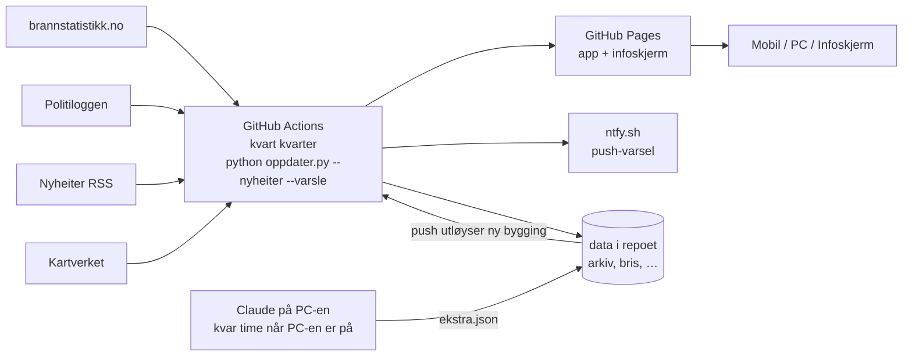

# Brannlogg Stord

Ei nettside/app som viser brannar og andre oppdrag for brannvesenet i Stord kommune. Ho hentar data frå brannstatistikken, Politiloggen og lokale nyheiter, oppdaterer seg sjølv kvart kvarter og kan leggjast på heimeskjermen på iPhone, Android og Windows.

Laga av **Leander Wågen Lillerud**. Ikkje ein offisiell teneste frå Politiet, brannvesenet eller Stord kommune.

| | Adresse |
|---|---|
| App (mobil og PC) | https://bls.lillerud.com/ (den gamle adressa lillerud-land1.github.io/brannlogg/ sender vidare) |
| Infoskjerm / TV | Hemmeleg adresse – lenka får du i appen under Innstillingar → Admin-tilgang |
| Kjeldekode og køyringar | https://github.com/Lillerud-land1/brannlogg |

---

## 1. Kva appen gjer

- **Teljar**: «N dagar sidan siste hending» som overskrift (alle oppdrag, også brannalarmar), med siste hending og siste brann i ei setning under.
- **Utsjånad** (sidan 10. oktober 2026): éi skrift (Atkinson Hyperlegible Next, laga for å vere lett å lese), kvit grunn, raudt berre for brann. Lista er gruppert per dag, og kvar hending blir opna med eit trykk. Klokkeslett blir skrivne «kl. 23.53».
- **Hendingar siste 100 dagar** (stripa): éin strek per dag for dei siste 100 dagane. Høgda og fargen viser kva slags dag det var (brann høgast, så anna oppdrag, så alarm utan brann). Ordet «brannstripa» skal ikkje brukast i appen eller på TV-en.
- **Liste** over hendingar med stad, tid, alvorsgrad, heile politiloggen, nyheitslenker og lenke til kart. Viser 20 om gongen («Vis 20 til»).
- **Filter**: Brannar / Utan alarmar / Alt (standard) (med automatiske brannalarmar), Siste 100 dagar / I år (frå 1. januar) / Alle, type og fritekstsøk.
- **Kart** over Stord med alle hendingar dei siste 12 månadene som har kjend stad. Fargen viser kor alvorleg det var (som på TV-en), alarmar er tomme ringar, og dei siste 100 dagane er større og blinkar.
- **Del-knapp** på kvar hending: opnar delingsmenyen på mobilen (SMS, Messenger …), elles blir lenka kopiert.
- **Temadagar** (berre på sjølve dagen, i appen og på TV-en i staden for månadens tips): bålforbodet startar 15. april, sankthansaftan, brannvernuka (veke 38), røykvarslardagen 1. desember, julaftan og nyttårsaftan. Tekstane står i `TEMA` i `oppdater.py`.
- **«Pågår no»**: raudt banner øvst på alle faner når politiet har ei aktiv hending med ny melding siste 3 timar (same regel som alarmmodus på TV-en).
- **Året i ruter** øvst under Statistikk: éi rute per dag sidan 1. januar (kolonne = månad), farga etter kva slags dag det var, og talet på brannar per månad under (`aaret()` i `mal.html`).
- **Statistikk** for siste 12 månader: knappar for å sjå fordelinga per månad, årstid, vekedag eller klokketime, og for å filtrere på gruppe og type. I tillegg type, tid på døgnet og konsekvensar.
- **Innstillingar** (eiga fane): språk (nynorsk, bokmål, engelsk), fargeblind-vennlege fargar, lys/mørk/automatisk utsjånad, stor tekst, rørsle av/på og kva appen opnar med. Blir lagra i nettlesaren (`localStorage`, nøkkel `brannlogg_innst`).
- **Språk**: nynorsk er grunnspråket. Bokmål og engelsk er omsett med KI (Claude) i tabellen `OMSETJING` i `mal.html` (rader med `[nynorsk, bokmål, engelsk]`). Nye tekstar i appen må pakkast inn i `T("…")` og leggjast inn i tabellen. Tekst frå politiet og media blir ikkje omsett.
- **Skogbrannfare** (i appen og på TV-sida): 0–100 % på ein skala frå svært låg til ekstrem, rekna ut med Fire Weather Index (same metode som EU/EFFIS) frå vêrdata for Leirvik frå Open-Meteo (temperatur, luftfukt, vind og nedbør dei siste tre månadene). Viser også sist det regna, og offisielt farevarsel om skogbrannfare frå MET når det finst. Ikkje ei offisiell vurdering. Koden er `hent_brannfare()` i `oppdater.py`.
- **Varsel på mobilen** via den gratis appen ntfy.
- **TV-versjon** for infoskjerm (til dømes Infoskjermen), med klokke, store tal og automatisk oppdatering.
- Opne sider hentar nye data sjølv, så ei fane som står open, blir ikkje gammal.

På PC fungerer fanene øvst (Liste, Kart, Statistikk, Om appen, Innstillingar) som eigne sider, akkurat som fanelinja nedst på mobil.

---

## 2. Kjelder

| Kjelde | Kva ho gir | Merknad |
|---|---|---|
| **Brannstatistikk.no** (DSB/BRIS) | **Hovudkjelda.** Alle oppdrag Stord brann og redning har registrert: type og tidspunkt. | Ingen stad eller tekst. Kommunenummer 4614. |
| **Politiloggen** (Politiet, NLOD 2.0) | Stad, tekst og tidslinje for hendingar. Kjem ofte først. | Kategorien «Brann», og andre hendingar der teksten nemner brannvesenet eller «nødetatene». |
| **Nyheiter via RSS** | Berre lenker og tilleggsinfo til hendingar frå Politiloggen og brannstatistikken – aldri eigne hendingar. | Radio Haugaland, Sunnhordland, Stord24, NRK Vestland, Haugesunds Avis, Bømlo-Nytt. |
| **Kartverket** | Stadfesting (adresse/stadnamn → koordinatar) og kommunegrense. | ws.geonorge.no |
| **OpenStreetMap** | Kystlinja i kartet (© OpenStreetMap-bidragsytarar, ODbL). | Henta éin gong med `lag_kart.py`. |

Bilete frå nyheitssaker blir **ikkje** kopierte (opphavsrett). Appen lenkjer berre til sakene.

### Slik blir kjeldene kopla saman

1. Alle oppdrag frå brannstatistikken blir henta (siste år, lagra i `bris.json`).
2. Kvart oppdrag blir kopla til ei hending i Politiloggen dersom politiet skreiv om henne frå 15 minutt før til 90 minutt etter at brannvesenet fekk melding, og typen passar (brann ↔ brann, trafikk ↔ trafikk osv.).
3. Nyheitssaker blir kopla til oppdrag frå inntil 36 timar før til 1 time etter at saka kom ut.
4. Resultatet:
   - **Kopla hending**: tekst og stad frå Politiloggen/media + merket «Brannstatistikk: *type*».
   - **Berre i brannstatistikken**: vist som til dømes «Brann (anna) · Stord», utan stad.
   - **Berre i Politiloggen**: blir vist med ein gong. Utrykkingar (ikkje brannar) som brannvesenet ikkje har registrert etter 3 dagar, blir fjerna, sidan brannvesenet då truleg ikkje var med.
   - **Berre i media**: blir ikkje vist. Ei nyheitssak kan nemne Stord utan at noko skjedde her (døme: ei sak om ein person frå Stord som drukna i Nord-Noreg).
5. Oppdragstypen frå brannstatistikken avgjer gruppa:
   - **brann**: «Brann i bygning», «Brann annet», «Brann i skorstein», «Brann i personbil» …
   - **utrykking**: trafikkulykke, person i vatn, dyreoppdrag, helseoppdrag, forureining, brannhindrande tiltak …
   - **alarm**: «ABA …» (automatisk brannalarm), «Avbrutt utrykning …», «Unødig …» — berre synlege under «Alt» i appen, men med i lista på TV.

---

## 3. Korleis det heng saman



- **GitHub Actions** gjer hovudjobben kvart kvarter, heilt utan at PC-en er på. Det er gratis for offentlege prosjekt. GitHub sine planlagde køyringar blir ofte hoppa over, så kvar køyring startar sjølv den neste etter om lag 15 minutt (jobben `neste` i arbeidsflyten). Cron på skeive minutt (:07, :22, :37, :52) er reserve om kjeda stoppar.
- **Claude på PC-en** (planlagd oppgåve i Claude-appen, kvar time kl. :10) er ein ekstra kvalitetssjekk når PC-en er på: kontrollerer automatiske nyheitslenker, finn fleire saker, stad for oppdrag som berre står i brannstatistikken, og hendingar som ingen andre har fanga opp. Resultatet blir skrive i `ekstra.json` og sendt til GitHub.
- GitHub kan starte planlagde jobbar nokre minutt for seint (vanlegvis rundt 10 minutt).

---

## 4. Filer

| Fil | Innhald |
|---|---|
| `oppdater.py` | Hovudskriptet: hentar alle kjelder, koplar, klassifiserer, byggjer sidene og sender varsel. Berre standardbiblioteket i Python. |
| `mal.html` | Mal for appen. Data blir sett inn der det står `/*__DATA__*/null`. |
| `mal-tv.html` | Mal for TV-/infoskjermversjonen. |
| `mal-tv.webmanifest` | Mal for app-manifestet til infoskjermen (adressa blir fylt inn ved bygging). |
| `.github/workflows/oppdater.yml` | GitHub Actions: køyrer skriptet kvart kvarter og legg ut sida. |
| `.github/workflows/vakt.yml` | Vakt kvart kvarter: varsel til eigaren (privat ntfy-kanal) om nettsida ikkje er oppdatert på over ein time. |
| `ekstra.json` | Manuelle tillegg og rettingar per hending (sjå under). Skrive av Claude eller for hand. |
| `arkiv.json` | Alle tråder frå Politiloggen som er tekne vare på (Politiloggen gir berre eitt år bakover). |
| `bris.json` | Arkiv over oppdrag frå brannstatistikken. |
| `bris_utan_info.json` | Oppdrag berre i brannstatistikken (siste 14 dagar) som Claude kan finne stad for. |
| `auto_kjelder.json` | Nyheitslenker funne automatisk. |
| `varsla.json` | Hendingar det alt er sendt varsel om (så ingen får same varsel to gonger). |
| `geokode.json` | Mellomlager for stadfesting frå Kartverket. |
| `kart.json` | SVG-kart over Stord (laga av `lag_kart.py`). |
| `lag_kart.py`, `lag_ikon.py` | Køyrde éin gong for å lage kart og app-ikon. |
| `nettside/` | Det som blir lagt ut: `index.html`, infoskjermen og `tv.html` (blir bygde, ikkje i git), manifest, ikon, `sw.js` (fungerer utan nett), `qr.svg`, `status.json`. |

### `ekstra.json`

Nøkkelen er id-en til hendinga: id frå Politiloggen (t.d. `26bmrv`), `d-<id>` for oppdrag berre i brannstatistikken, `n-<id>` for mediehendingar. Moglege felt:

| Felt | Verknad |
|---|---|
| `kjelder` | Liste med nyheitslenker `{kjelde, tittel, url}` |
| `merknad` | Kort faktatekst som blir vist i ein boks på kortet |
| `tittel`, `type`, `alvor` (1–3), `stad`, `pos` ([lat, lon]), `tekst` | Overstyrer det som er rekna ut |
| `omkomne` | `true` gir merket «Omkomne» |
| `avvis` | Liste med url-ar til automatiske lenker som er feil (blir skjulte) |
| `avvis_hending` | `true` skjuler ei feil mediehending/oppdrag |
| `sokt` | Tidspunkt Claude sist søkte etter nyheiter (unngår nye søk) |

Lista `_hendingar` (hendingar lagde inn for hand) blir ikkje lenger brukt – alle hendingar skal kome frå Politiloggen eller brannstatistikken.

---

## 5. Kommandoar

Køyrast i mappa `C:\Claude\stordbrann`:

```bash
python oppdater.py                       # byggjer sidene lokalt (utan nyheitssøk og varsel)
python oppdater.py --nyheiter            # + les nyheitsfeedar
python oppdater.py --nyheiter --varsle   # som GitHub køyrer (varsel krev NTFY_TOPIC)
python oppdater.py --sjekk               # listar hendingar som treng nyheitssøk/kontroll (skriv ingen filer)
python oppdater.py --send-ekstra         # sender ekstra.json til GitHub, som byggjer sida på nytt
```

Lokalt kan sidene sjåast med `python -m http.server 8765` og opnast på `http://localhost:8765/nettside/`.

Før eigne endringar lokalt: `git pull --rebase --autostash` (GitHub legg inn nye data kvart kvarter).

---

## 6. Varsel på mobilen (ntfy)

1. Last ned **ntfy** ([App Store](https://apps.apple.com/app/ntfy/id1625396347) / [Google Play](https://play.google.com/store/apps/details?id=io.heckel.ntfy)).
2. Trykk **+** og abonner på ein av kanalane:
   - `brannlogg-stord-fa9d8bb7`: alle oppdrag utan alarmar (ikkje automatiske brannalarmar)
   - `brannlogg-stord-fa9d8bb7-brann`: berre brannar
3. Trykk på eit varsel for å opne hendinga i appen.

**Månadleg samandrag:** den 1. i kvar månad (første køyring etter kl. 9) går eit samandrag av førre månad til hovudkanalen, til dømes «September 2026: 20 oppdrag – 2 brannar, 5 andre oppdrag og 13 alarmar utan brann. Same månad i fjor: 21». Tal frå brannstatistikken (`send_manadssamandrag()`).

Stega står òg i appen under **Om appen** (bjølla øvst). Kanalnamnet er lagra som GitHub-hemmelegheit `NTFY_TOPIC`. Gratisversjonen av ntfy har ingen tilgangsstyring, så alle som kjenner kanalnamnet, kan i teorien sende meldingar til han.

### Vakt-varsel til eigaren

Ein eigen arbeidsflyt (`vakt.yml`) sjekkar kvart kvarter at nettsida er oppdatert siste timen. Er ho ikkje det, avbryt han køyringar som heng, startar oppdateringa på nytt og sender varsel til ein **privat** ntfy-kanal. Påminning kjem kvar 3. time, og éi melding når alt verkar igjen. Vakta på PC-en (`--sjekk`) gjer det same når PC-en er på.

Kanalnamnet står **ikkje** i appen eller her. Det ligg i GitHub-hemmelegheita `NTFY_VAKT` og i `vakt_kanal.txt` på PC-en (ikkje i git). Test: `python oppdater.py --vakt-test`.

---

## 7. Infoskjerm (TV)

- **Adressa er hemmeleg.** Lenka får du i appen under **Innstillingar → Admin-tilgang** (skriv inn admin-koden). Ho står ikkje i klartekst nokon stad i koden: byggjeskriptet hentar henne frå GitHub-hemmelegheita `TV_ADRESSE`, og adminpanelet har henne kryptert med admin-passordet (`TV_KRYPTERT` i `mal.html`). Passordet sjølv er ikkje lagra nokon stad.
- Den gamle adressa `bls.lillerud.com/tv.html` viser berre at infoskjermen har fått ny adresse.
- **Byte passord** (same adresse): rekn ut ny `TV_KRYPTERT` med kommandoen under og legg verdien inn i `mal.html`.
- **Byte adresse** (om lenka er delt med for mange): lag ei ny adresse, til dømes med `python -c "import secrets; print('tv-' + secrets.token_hex(8))"`, lagre henne med `gh secret set TV_ADRESSE`, og rekn ut ny `TV_KRYPTERT`. Neste bygging flyttar skjermen, og den gamle lenka sluttar å verke. Hugs å oppdatere adressa på Infoskjermen.no.
- Ny `TV_KRYPTERT` (set `TV_ADRESSE` og `ADMIN_KODE` som miljøvariablar først):
  `python -c "import hashlib,os; n=os.environ['TV_ADRESSE'].encode(); k=hashlib.pbkdf2_hmac('sha256', os.environ['ADMIN_KODE'].encode(), b'brannlogg-admin-v2', 600000, len(n)); print(bytes(a^b for a,b in zip(n,k)).hex())"`
- Viser alle hendingar (også brannalarmar), klokke, «dagar sidan siste hending», stripe, tal for **i år** (frå 1. januar) og **same tid i fjor** (oppdrag i brannstatistikken, `hent_fjor()`), kart, månadens brannverntips og QR-kode til appen.
- Sjekkar etter nye data kvart 2. minutt, lastar heile sida på nytt kvar time og ved midnatt, og held skjermen vaken.
- **Infoskjermen.no**: «Nytt oppslag» → «Nettside» → lim inn adressa → vel **Fullskjerm** → lagre. Sida kan visast i iframe (https, inga innlogging).
- PC/TV: opne adressa i Edge/Chrome og trykk F11.

---

## 8. Endre ting

| Ønske | Kvar |
|---|---|
| Talet på dagar i stripa/lista (100) | `VINDAUGE_DAGAR` i `oppdater.py` |
| Kor ofte det blir oppdatert | `cron` i `.github/workflows/oppdater.yml` (UTC) |
| Nyheitskjelder | `NYHEITSFEEDAR` i `oppdater.py` |
| Stadnamn som tel som Stord i nyheiter | `STORD_STADER` i `oppdater.py` |
| Korleis brannstatistikk-typar blir gruppert | `bris_kategori()` / `BRIS_TITTEL` i `oppdater.py` |
| Utsjånad og tekstar | `mal.html` / `mal-tv.html` |
| Brannverntips (eitt per månad) | `TIPS` i `mal.html` og `mal-tv.html` |

Endringar i `oppdater.py`, `mal.html`, `mal-tv.html`, `ekstra.json` eller arbeidsflyten startar ei ny bygging automatisk når dei blir sende til GitHub.

---

## 9. Feilsøking

| Problem | Løysing |
|---|---|
| Sida er ikkje oppdatert | Sjå **Actions** på GitHub: grøn hake = ok. Last sida på nytt (F5). Statusprikken øvst blir oransje om dataa er over 3 timar gamle. |
| Mange køyringar blir «cancelled» | Ei køyring heng (t.d. «waiting» hos GitHub) og blokkerer dei andre. Jobben `rydd` avbryt automatisk køyringar som er over 60 minutt gamle, og vakta på PC-en gjer det same. For hand: `gh api -X POST repos/Lillerud-land1/brannlogg/actions/runs/<id>/force-cancel`. |
| «Oppdrag – detaljar kjem» | Brannvesenet har ikkje fylt ut typen i brannstatistikken enno. Blir retta av seg sjølv. |
| Ei nyheitslenke eller mediehending er feil | Legg url-en i `avvis` eller set `avvis_hending: true` i `ekstra.json`, og køyr `--send-ekstra`. |
| Feil stad på kartet | Set `pos: [lat, lon]` eller `stad` for hendinga i `ekstra.json`. |
| Ingen varsel | Sjekk at du abonnerer på rett kanal i ntfy og har tillate varsel. Brannalarmar gir aldri varsel. |
| Innlogging til GitHub er borte på PC-en | `gh auth login` (koden blir skriven inn på https://github.com/login/device). |

Brukarar kan rapportere feil med knappen **«Rapporter eit problem»** under Om appen (e-post til brannloggstord@gmail.com).

---

## 10. Avgrensingar

- Oppdrag brannvesenet ikkje registrerer, eller som berre står på Facebook, kjem ikkje med.
- Brannstatistikken oppgir ikkje stad. Slike oppdrag står som «Stord» utan kartpunkt til ein annan kjelde gir stad.
- Alvorsgraden er rekna ut automatisk frå teksten og er ikkje ei offisiell vurdering.
- Nyheitsfeedane viser berre dei nyaste sakene. Derfor blir dei lesne kvart kvarter.
- Politiloggen gir berre eitt år bakover. Eldre hendingar blir tekne vare på i `arkiv.json` frå no av.

---

## 11. Tryggleik

Appen er ei statisk nettside på GitHub Pages: det finst ingen server, database, innlogging eller eigne API-endepunkt som kan angripast. Alle data i appen er offentlege frå før. Det som er gjort for å hindre misbruk:

| Vern | Kva det hindrar |
|---|---|
| **Kontroll av alle data** før dei kjem inn i sida (`rens_hending()`, `rens_brannfare()` i `oppdater.py`) | Ugyldige felt blir retta eller fjerna. Lenker må vere `http(s)` til ein godkjend nettstad (`LENKE_DOMENE`) – `javascript:`-lenker og ukjende nettstader blir fjerna og lista som `AVVIST_LENKE` i loggen. |
| **Escaping** av all tekst i sida (`esc()`, `trygUrl()` i malane) og `<` → `<` i dataa | Tekst frå Politiloggen, nyheiter eller `ekstra.json` kan ikkje bli til HTML eller skript. |
| **Content-Security-Policy** med sha256-hashar (`med_csp()`) | Nettlesaren køyrer berre skripta som er i malen. Innsmugla skript, `onerror=` o.l. og skript frå andre nettstader blir blokkerte. |
| **GitHub Actions**: ingen løyve som standard, kvar jobb berre det han treng; actions låste til commit-SHA | Ein kapra action eller jobb kan gjere minst mogleg. |
| **GitHub**: secret scanning og push protection er på; berre eigaren kan skrive til repoet | Nøklar som ved eit uhell blir lagde inn, blir stoppa. |
| **Claude-oppgåva** (planlagd på PC-en) har berre løyve til to faste kommandoar + nettsøk, og har fått beskjed om at innhald frå nettet aldri er instruksjonar | Ei nettside med skjulte instruksjonar («prompt injection») kan ikkje styre agenten. Sjølv om ho skulle klare det, stoppar kontrollen over farlege lenker og skript. |
| `.gitignore` | `.env`, nøklar og originalfilene til logoen kan ikkje kome med i repoet ved eit uhell. |

**Hemmelegheiter:** `TV_ADRESSE` (adressa til infoskjermen) og `NTFY_TOPIC` (GitHub-hemmelegheiter). Kanalnamnet til ntfy står òg i appen og her, sidan brukarane treng det for å abonnere – så det er ikkje eigentleg hemmeleg. Legg aldri nøklar, passord eller token i filene i repoet; bruk GitHub-hemmelegheiter.

**Admin-passordet** står ingen stad. Adressa til infoskjermen ligg kryptert i appen med ein nøkkel som blir rekna ut frå passordet med PBKDF2 (med vilje tregt), og i klartekst berre i `TV_ADRESSE`. Ho kan ikkje lesast i kjeldekoden, og med eit langt passord er det svært tungvint å prøve seg fram. Passord som er lette å gjette (namn, gamle kodar), gjer vernet svakare. Den publiserte nettsida (byggjeartefakten i Actions) kan i éin dag lastast ned av innlogga GitHub-brukarar, så adressa er ikkje 100 % hemmeleg. Legg aldri noko som må vere skikkeleg hemmeleg bak admin-koden.

**Kjende avgrensingar:** Alle som kjenner ntfy-kanalnamnet, kan sende falske varsel til kanalen (gratisversjonen av ntfy har ingen tilgangsstyring). Det kan berre løysast med betalt ntfy-konto med reservert kanal eller eigen ntfy-server.

Når nye tekstfelt eller lenker blir lagde til i appen: legg dei inn i `rens_hending()` (elles blir dei fjerna) og bruk `esc()` / `trygUrl()` i malen. Nye `<script>`-blokker i malane får hash automatisk; inline-hendingar som `onclick="…"` vil ikkje verke (bruk `addEventListener`).
